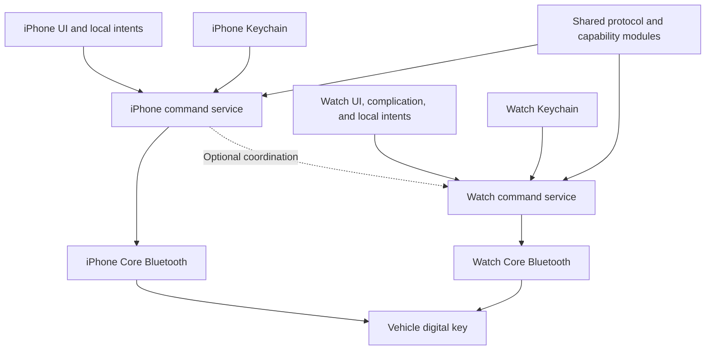

# Planned architecture

Status: design only. The first implementation should use Swift, SwiftUI, and shared Swift modules. Keep the core independent of the phone UI. Use a provisional baseline of iOS 17 and watchOS 10; confirm the owner's devices before setting deployment targets. Test current OS releases, including the iOS 26 relaunch rules.

## Shared responsibilities

| Module | Responsibility |
| --- | --- |
| VehicleDomain | Explicit commands, capability profiles, and state with timestamps |
| DigitalKeyProtocol | Frame parsing, payload encoding, and response decoding |
| DigitalKeyCrypto | Reviewed crypto adapter and certificate policy |
| DigitalKeySession | Authentication state machine, deadlines, reconnect, and serialized commands |
| VehicleCommands | Capability checks, command dispatch, and evidence-based results |
| ProximityPolicy | Pure state transitions with injected observations and time |

Start with the smallest useful module set. These names describe responsibilities, not a requirement to create six packages immediately.

Each platform owns its BLE transport, lifecycle, Keychain adapter, UI, and App Intent entry points. An online enrollment component, if needed, must be separate from command execution. It must not contain a remote-control fallback.

## Session and command state

Use explicit states: no credential, idle, discovering, connecting, authenticating, ready, executing, and failed. A failed digital-key check cannot lead to ready.

Command results must distinguish not supported, not in range, device busy, sent, received, rejected, timed out, and state verified. A link failure after send has an uncertain outcome. Do not retry moving controls automatically.

Commands from the UI and intents use the same serialized service. Widgets must not open a second competing session. Select foreground execution when extension runtime cannot complete a handshake. Store only non-secret display state for widget rendering.

## Device coordination

Test whether the GCC car accepts more than one peer. Until then, plan for one. Prefer one active device session, bounded handover, and a lease that expires without phone contact. If the phone is absent, the watch must attempt its own connection without waiting indefinitely for a phone reply.

Optional Watch Connectivity messages can request release or synchronize non-secret capability data. Separate enrollment is preferred over cloned credentials, subject to backend support. If cloning is the only route, record its access and revocation consequences before selecting it.

## Proximity policy

Keep proximity disabled until calibration and lifecycle tests pass. Arm it only for an authenticated selected car. Use separate entry and exit thresholds, smoothing, dwell time, stale-signal rejection, and a cooldown. Measure values on the real devices; do not copy Android RSSI constants.

Plan states for disabled, armed-far, near-candidate, unlocked, exit-candidate, lock-requested, and lock-unconfirmed. Loss of signal cannot mean “locked.” Request lock while the connection is usable, or rely on a separately verified vehicle-side function. If neither path confirms the result, retain an unconfirmed state and notify the owner when the OS permits it.

Test a phone left inside the car, a second key nearby, an open door, and a watch near the vehicle while the owner remains indoors. RSSI cannot reliably distinguish all of these conditions. Do not enable an automatic behavior that has no safe policy for them.

## Interface plan

Use an original vehicle image, battery/range only when a supported data source exists, a clear lock control, connection status, and a short row of quick actions. Put climate and secondary controls on simple detail screens. On the watch, use large controls and short lists with the same supported capability set.

Use the Tesla app as a layout reference, with original assets and labels. Show the age of stored data. Keep protocol IDs, region host names, and research controls out of normal user flows.
