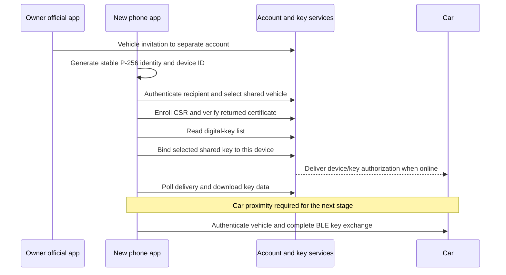

# UAE Digital Key 1.0 enrollment

Research date: 2026-09-19. Scope: enrollment research for the owner's iPhone and
2024 GCC ZEEKR 001. No account login, vehicle invitation, key creation, key
revocation, or car command was performed in this study.

## Result

The best candidate is a **separate UAE ZEEKR account with shared vehicle access**.
The new app would generate its own device key, enroll its public certificate,
and bind a shared digital key to that new identity. The official app would keep
the owner's existing key and account. This route is supported by EU upstream
reports and source code. It is **not yet validated for this UAE account**.

The owner's **Share vehicle** action takes an email address. It is a useful
starting point. It is different from copying the existing owner key. We must
still establish whether this invitation gives the recipient a Bluetooth key,
which permissions it gives, and whether acceptance needs the official app.
The absence of a Share action on the existing key page does not settle those
questions.

The remaining barriers are concrete:

1. Obtain the correct regional request-signing material and confirm the UAE
   account, vehicle, and digital-key service settings.
2. Confirm that the vehicle share produces a usable Digital Key 1.0 entitlement.
3. Enroll a separate device identity without replacing the working owner key.
4. Confirm delivery to the car, then perform the first BLE authentication nearby.

The existing iPhone is enough to inspect the official UI and identify its app
version. Normal iOS app access does not let our app read the official key or
account token. A working key in the official app is not an import format.

## Target facts and evidence

| Fact | Evidence | Limit |
| --- | --- | --- |
| Installed app is `com.zeekr.global`, version `1.6.6` | Read-only `devicectl` app metadata on the owner's iPhone | Not an inspection of the binary, storage, or traffic |
| Account region is United Arab Emirates | Owner report in this task | No account-service response captured |
| Existing key is an owner key, labelled Digital Key 1.0 | Owner report | Private-key storage and key policy are unknown |
| Existing key page offers Delete, but no Share action | Owner report | Does not describe other authorization pages |
| Share vehicle asks for an email | Owner report | Invitation not sent; Bluetooth permission not confirmed |
| Manual official Bluetooth key works | Earlier owner report | No project BLE test |
| Car is about 200 m away | Owner report | Treat BLE tests as unavailable for this research session |
| OpenZeekr provisions a new device key | Source and EU upstream report [1][2] | No GCC enrollment report found in the sources reviewed |

The Apple store lookup also returned global app version 1.6.6. That is a separate
publication check, not the proof of the installed version.

## What can happen away from the car

| Step | Needs phone internet | Needs nearby BLE | Can affect an existing key or session |
| --- | --- | --- | --- |
| Inspect the owner app and sharing choices | Usually | No | No, if no action is submitted |
| Create a secondary account | Yes | No expected BLE dependency | Creates an account; not performed here |
| Send and accept a vehicle invitation | Yes | No BLE dependency established in the reference | Changes vehicle access; exact UAE flow unknown |
| Generate our app's device key and CSR | No | No | Local identity only |
| Authenticate and enroll the certificate | Yes | No in the reference | Can register or displace an account device session |
| Accept/bind a shared digital key | Yes | No in the reference request | Changes key-to-device binding and can start a push to the car |
| Poll cloud-to-car delivery | Yes; car also needs service access | No in the reference | Polling itself is read-only; delivery may remain pending |
| Download key material | Yes | No in the reference | Requires an authorized, correctly bound key |
| First BLE authentication and key acceptance | Not intended for later routine commands | Yes | Must be checked on the target car |
| Prove offline unlock, lock, and start | Phone network off for the test | Yes | Physical vehicle test |

Distance from the car is not the main barrier to online setup. An asleep or
offline car can still prevent synchronization. A successful download must be
reported as **credential received**, not **vehicle key working**. Do not send a
cloud unlock or other vehicle command to wake the car during enrollment research.

## Why the existing iPhone key is not the route

Apple checks Keychain access-group and application entitlements. Keychain items
can be shared between appropriately entitled apps from the same developer [7].
Our independently signed app does not have the official app's access rights.
The same phone, a trusted Mac connection, and Developer Mode do not grant them.

The installed-app query returns metadata. It does not export the official app's
Keychain or its App Store data container. Apple documents device-bound Keychain
classes as unusable on another device after backup. We do not know which class
ZEEKR uses. Do not claim that its exact key is in the Secure Enclave, exportable,
or recoverable from a backup without evidence.

A certificate, Bluetooth pairing, a VIN, or a downloaded digital-key blob alone
is insufficient. The reference also needs the **matching enrolled private key**,
stable device ID, key ID, selected vehicle, and backend binding. Its own key
pair is generated before certificate enrollment. It does not extract the
stock app's private key [2].

Apple Wallet Digital Key 3.0 is a different system. ZEEKR's EU documentation
separates DK1 Bluetooth from DK3 Wallet/UWB [8]. The owner has confirmed DK1.
Wallet export or a DK3 setup guide is not an established solution for this car.

## Account and regional routing

There are several independent names called a region. They must not be merged:

| Setting | Current evidence | Implementation decision |
| --- | --- | --- |
| Account country | Owner selected UAE; ISO country is `AE` | Keep `AE`; do not use the reference default `SE` or `AU` |
| Account gateway/signing family | Extractor distinguishes CN, SEA, EU, and EM [6] | Select from the observed gateway, not from the car's market name |
| Country-to-service discovery | `GET /overseas-app/region/url` returns country rows in the API source [4] | Require the `AE` row and its service URLs |
| TSP region code | HA source maps AE, BH, KW, and QA to `UAE` [5] | A source lead; not a captured account result |
| Middle East TSP host | API source maps `UAE` to `https://me-snc-tsp-api-gw.zeekrlife.com/` [4] | Candidate host; digital-key availability is untested |
| TSP project ID | The API maps EU and LA explicitly; UAE falls back to `ZEEKR_SEA` [4] | Unverified fallback. Do not invent `ZEEKR_UAE` or treat the fallback as proven |
| ECARX/xchanger region | OpenZeekr hard-codes the EU host and client [3] | UAE host, app/client values, and signing key remain unresolved |

The API's initial discovery host is
`https://gateway-pub-hw-em-sg.zeekrlife.com/overseas-app/`. Its returned row contains
`appServerUrl`, `userCenterUrl`, `messageCoreUrl`, and `regionCode`. Host paths
must retain their path prefixes and use a consistent trailing slash. A future
client must validate the returned HTTPS hosts before it sends credentials.

A single unsigned GET to this exact public discovery route returned **HTTP 401**,
code `0001`, message `access key or signature missing`. No account identifier,
password, or token was sent. This verifies the signature barrier, not the UAE
route. No authenticated endpoint was called.

The current extractor maps its newer `EM` family to `gateway-pub-em.zeekrlife.com`
and `SEA` to `gateway-pub-hw-em-sg.zeekrlife.com`. The API bootstraps through the
second host. This is why “use EM because UAE is an emerging market” is not enough.
The actual gateway and its matching key family must be established together.

## Account authentication before the digital key

OpenZeekr's account code uses this flow [3]:

1. Signed account check with `auth/checkUserV2`.
2. `auth/loginByEmailEncrypt`, with the password encrypted under the configured
   RSA public key. Read the user-center token from the successful response.
3. `user/info` and `user/tspCode` for the TSP client.
4. A separate authorization-code/session flow for ECARX/xchanger.
5. `ms-user-auth/v1.0/auth/login`, with `identityType=10`, to obtain the TSP bearer.
6. `ms-app-bff/api/v4.0/veh/vehicle-list?needSharedCar=true` to list authorized cars.

OpenZeekr also attempts push-device registration and an app-online heartbeat.
Its comments link them to session ownership, but do not establish their exact
necessity on GCC. They are not read-only discovery. Do not copy them into a
background login retry loop.

The reference uses separate signing layers:

- User-center: HMAC-SHA256 headers and a date, with regional application values.
- TSP: bearer token and HMAC-SHA256 over selected headers, query, JSON body hash,
  method, and path. The headers include a nonce and timestamp. The body hash is
  Base64-encoded MD5 of compact JSON with sorted object keys. The exact
  transmitted JSON bytes must match the signed body.
- Digital key: ECDSA-SHA256 with our enrolled P-256 private key over
  `userId + deviceId + vin`, encoded as UTF-8 in the implementation; signature
  is DER encoded, then Base64 without line breaks. There are no separators
  between the three input values.

The xchanger request has an additional HMAC-SHA1 scheme. Its source comments
refer to the TSP signing secret, but the code reads a separate
`xchangerSignSecret` configuration field. Do not assume these values are equal.

Numeric `userId`, account UUID, app-instance UUID, xchanger device ID, and DK
`deviceId` are separate identifiers. The source prefers the numeric user ID from
the TSP bearer payload, then falls back to user-info or the stored value. Parsing
a JWT payload is not signature verification. A future client must not treat an
arbitrary imported token as a verified identity.

The reference reports one active session per account. A second app login can
sign the official app out [1]. This is a reason to investigate a separate shared
account. It does not prove that the official key is revoked when a cloud session
ends, or that two distinct accounts can never conflict at the car's BLE radio.

## Shared-key enrollment sequence

The following is a source-derived specification, not a tested UAE recipe [2].
The first invitation is sent through the owner's official **Share vehicle** UI.
Its email endpoint is not established here. The endpoint named `share-key`
below is the **recipient's device binding** operation: its body has no email.

### Device identity and certificate

The reference generates a P-256 key pair and a random 32-byte device ID encoded
as 64 lower-case hexadecimal characters. Both stay stable across retries.
It builds a PKCS#10 CSR signed with ECDSA-SHA256 and sends it as PEM text in the
`csr` field. The subject shape in the source is
`C=CN,ST=ZheJiang,L=Hangzhou,O=ECARX,OU=CloudDept,CN=<short device value>`.
The CN contains the first eight characters of the device ID. This is source
behavior with an EU upstream claim, not proof of a UAE requirement.

`create-app-certificate` returns `data.cert` as Base64 DER in the source. A port
must check the API result, certificate format, public-key match, validity, and
required identity/usage policy before it accepts the certificate. Merely
receiving a `cert` string does not complete enrollment. The iPhone can generate
and sign with a local P-256 key; CSR encoding and interoperability need tests.
The long-term enrollment key is separate from the later ephemeral BLE key.

### Service methods

Prefixes relative to the verified TSP host:

- `CERT`: `ms-tsp-dkbs-geely/api/v1.0/app/certificatecenter`
- `DKC`: `ms-tsp-dkbs-geely/api/v1.0/app/digital-key-center`

| Method | Path | Relevant request fields | Meaning and guard |
| --- | --- | --- | --- |
| POST | `CERT/create-app-certificate` | `deviceId`, `csr` | Enroll this app identity; preserve it across interruptions |
| POST | `DKC/key-list` | `deviceId`, `signature`, `dkType=2`, `type=2` | Find the selected vehicle's Bluetooth key; this is not “owner type 2” |
| POST | `DKC/share-key` | `deviceId`, `dkId`, `signature` | Accept/bind the recipient key; inspect existing binding first |
| POST | `DKC/create-owner-blu-key` | `deviceId`, `proprietary`, `signature` | Owner-key creation; not the proposed path for this existing owner key |
| GET | `DKC/loop-key-status` | `dkId`, `syncType=1` | Poll status with a deadline; pending is not ready |
| GET | `DKC/key-info` | `deviceId`, `dkId`, `mobileBrand`, `mobileModel`, `signature` | Download material for the bound identity |
| GET | `DKC/phonecoef` | `mobileBrand`, `mobileModel`, optional `coefHash` | Retrieve phone calibration; do not use Pixel values for the iPhone |
| POST | `DKC/repush-key-to-vechile` | `deviceId`, `dkId`, `signature` | Mutates delivery state; retain the source spelling; not a connection test |
| POST | `DKC/sync-key-list` | Same request shape as `key-list` | Mutates the car key list; not routine polling |
| POST | `DKC/remove-one-key` | `deviceId`, `dkId`, `signature` | Requests revocation; local deletion is a separate action |

The reference treats `000000` as a DK API success code. Its xchanger flow uses
`1000`. A port must check both the HTTP response and the correct endpoint's
application code; one global success rule is not sufficient.

### Binding and synchronization

Select the key by the selected vehicle and expected account/role, not by array
position. An unbound shared key and a key already bound to another device are
not interchangeable. Require a confirmed, intentional device-transfer policy
before any rebind. Refresh the key list after binding and check the device ID.

The source names states 1=created, 2=synced, 3=authenticated, 4=authentication
failure, and 5=activated. It accepts 3 or 5 in its delivery poll. These are source
labels, not a complete manufacturer specification or physical-actuation proof.
Source comments warn that a `sync-key-list` call can move state 3 to 5 and change
the first-pair behavior. Do not run sync and repush calls blindly.

The shared path polls for up to 30 seconds and retries `key-info` up to six times
with two-second gaps while the key blob is empty. Those are reference defaults,
not target-car timing requirements. In our client, timeout must retain a pending
state. An interrupted mutation must be reconciled by a status read before retry;
do not create another key on every retry.

### Material to keep on the phone

| Material | Purpose |
| --- | --- |
| Locally generated private key and corresponding public key | Identity proof; private part stays device-only |
| Enrolled app certificate | Proves this identity to the vehicle |
| Stable DK device ID | Must match the binding and credential |
| Selected VIN and account/region association | Prevent cross-vehicle or cross-region reuse |
| Cloud `dkId` | Key-service identifier |
| Short hexadecimal `bookId` | BLE key ID; not the long cloud ID |
| `digitalKey` blob | Base64 in the response; decoded bytes are used in the BLE digital-key exchange |
| Supported calibration and phone model metadata | Kept separate from untested proximity settings |
| Certificate/key validity and synchronization evidence | Controls readiness and renewal |

Store credential material in device-only Keychain storage, with access rules
chosen for the required locked-screen behavior. Do not put it in UserDefaults,
logs, diagnostics, backups, or shared activity reports. The source also downloads
`cmacKeyCert`; its presence does not enable parking or justify motion tests.

### Lifetime and key limits

Credential lifetime, renewal, maximum offline duration, and shared-key quotas
remain unknown for this UAE account. The reviewed provisioning, identity, and
credential code has no explicit expiry or renewal flow. The upstream claim of
offline BLE use does not prove permanent offline validity. Record certificate
validity, any server expiry, permitted key count, and renewal behavior before
the app can claim long-term key use.

## Reference defects that a port must not preserve

1. **Existing owner key is not rebound.** In `DkProvisioning.provision`, an owner
   with an existing key can proceed to `key-info` even when `entry.deviceId` is not
   the new device. The binding branch is inside `if (!owner)`. This is not a
   demonstrated route for preserving the current owner key while adding our app.
2. **Wrong key can be selected.** The reference picks the first list entry and
   does not require the selected VIN to match `KeyItem.vin`.
3. **Failures can look complete.** Shared binding errors, repush errors, and
   synchronization timeouts can be logged and ignored. Certificate and key-info
   data can be consumed without requiring the expected success code. Our
   enrollment must stop or stay pending.
4. **Owner creation skips the shared path's delivery poll.** A local DONE status
   does not mean the vehicle received the new owner key.
5. **Revocation is best-effort but local deletion always runs.** The code can
   present a removed key after a server error. Keep vehicle revocation pending
   until evidence confirms it.
6. **Logs can contain credentials.** The debug HTTP logger and other debug paths
   can output tokens, key blobs, identifiers, and signing material. Do not copy
   the logging behavior or use unredacted upstream debug exports.
7. **Login has regional and device defaults.** EU hosts and a Pixel model are
   hard-coded. The source can continue after xchanger registration failure.
8. **A missing RSA key can send the password unchanged.** The reference helper
   returns the input password if its configured public key is blank. A port
   must fail before login in that condition.

These findings concern the reviewed open-source implementation. They are not
claims that the installed official iOS app has the same defects.

## How to resolve the remaining regional inputs

**Preferred first step: inspect the official sharing flow.** Record the recipient
account requirements, permission choices, acceptance method, expiry, and whether
the shared account has a Digital Key 1.0 setup action. Keep the owner key intact.
Account registration alone is different from digital-key activation. Do not
activate or enroll the recipient's key in the official app merely to inspect permissions;
that could bind it before our app is ready.

**For the API settings: inspect a legitimate global Android app copy in a separate
research environment, or inspect the official iOS app's network flow if normal
TLS inspection works.** The published extractor is for Android APKs. It is not
an iPhone key extractor [6]. Its reported tests include global Android 1.6.0,
not the installed iOS 1.6.6. Matching version numbers across platforms would not
prove matching native libraries, endpoints, or secrets.

The extractor now reports four static values from newer Android builds; VIN
header key/IV recovery remains a separate problem for those builds. Its README
suggests older-version values or runtime inspection. Those are upstream leads,
not verified UAE compatibility. OpenZeekr's additional xchanger inputs are not
covered by a claim that all six generic cloud values were recovered.

An iPhone HTTPS proxy can reveal requests only if the app accepts the proxy's
certificate and does not apply incompatible pinning. It cannot reveal a
non-exported private key just by observing traffic. Do not promise that an
ordinary packet capture decrypts TLS. No proxy, trusted root, VPN profile,
jailbreak, backup extraction, or official binary was installed or obtained here.

Only retrieve the service/signing inputs needed for the selected account route.
Store any later private app files and observations under `.local/`. Use a
separate shared account for login research where the service supports it.
A spare Android environment is a research aid; the final phone key should be
generated and held by the iPhone app, not cloned from an Android key.

## Next implementation boundary

Implement enrollment as a separate component with explicit states:
`no identity`, `account authenticated`, `vehicle selected`, `certificate enrolled`,
`key binding pending`, `vehicle sync pending`, `credential received`, and
`BLE validation pending`. Do not promote any of these to command-ready without
successful BLE authentication.

Before live enrollment, add synthetic tests for CSR encoding, certificate/key
mismatch, regional response validation, exact request signing, multiple vehicles,
wrong-device binding, empty key data, interrupted writes, pending synchronization,
expiry, session displacement, and incomplete revocation. A transport allowlist
must exclude cloud remote-control paths.

Enrollment can be developed separately from the remaining BLE crypto work.
The full-point ECDH derivation, GCM nonce constraints, vehicle certificate trust,
reconnect state, and response association remain as recorded in
[the BLE review](ble-protocol.md). A valid enrolled identity does not resolve them.

## Sources

[1]: https://github.com/borconi/openzeekr/blob/00661111f77fd613938309b8fb3f691ac79388f7/README.md
[2]: https://github.com/borconi/openzeekr/blob/00661111f77fd613938309b8fb3f691ac79388f7/core/src/main/java/com/openzeekr/app/ble/DkProvisioning.kt
[3]: https://github.com/borconi/openzeekr/blob/00661111f77fd613938309b8fb3f691ac79388f7/core/src/main/java/com/openzeekr/app/net/AccountLogin.kt
[4]: https://github.com/Fryyyyy/zeekr_ev_api/blob/4dc9e1789e577864003f9e27b293ade8d47e1e70/src/zeekr_ev_api/client.py
[5]: https://github.com/Fryyyyy/zeekr_homeassistant/blob/b7ecc7101107a11f6ba2e80bc0375464d6de500b/custom_components/zeekr_ev/const.py
[6]: https://github.com/Wysie/zeekr_key_extractor/blob/7875948c22172dc5ed30a83a1e7df748703b48d4/README.md
[7]: https://support.apple.com/guide/security/keychain-data-protection-secb0694df1a/web
[8]: https://www.zeekr.eu/en-se/connected

- [OpenZeekr identity and CSR code](https://github.com/borconi/openzeekr/blob/00661111f77fd613938309b8fb3f691ac79388f7/core/src/main/java/com/openzeekr/app/ble/DkIdentity.kt)
- [OpenZeekr request signing](https://github.com/borconi/openzeekr/blob/00661111f77fd613938309b8fb3f691ac79388f7/core/src/main/java/com/openzeekr/app/net/Signing.kt)
- [OpenZeekr request headers and JSON bytes](https://github.com/borconi/openzeekr/blob/00661111f77fd613938309b8fb3f691ac79388f7/core/src/main/java/com/openzeekr/app/net/Interceptors.kt)
- [API regional server constants](https://github.com/Fryyyyy/zeekr_ev_api/blob/4dc9e1789e577864003f9e27b293ade8d47e1e70/src/zeekr_ev_api/const.py)
- [Extractor gateway matching](https://github.com/Wysie/zeekr_key_extractor/blob/7875948c22172dc5ed30a83a1e7df748703b48d4/zeekr_extract_secrets.py)

The OpenZeekr default branch still pointed to the pinned revision when checked
in this study. Source comments refer to capture notes that are absent from its
public repository. Those comments are upstream claims, not captures independently
reviewed here. No successful GCC enrollment, binding, or BLE result was obtained.
